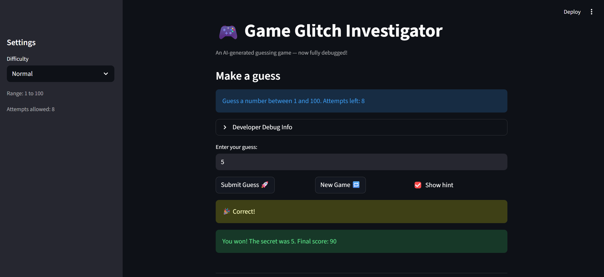

# 🎮 Game Glitch Investigator: The Impossible Guesser

## 🚨 The Situation

You asked an AI to build a simple "Number Guessing Game" using Streamlit.
It wrote the code, ran away, and now the game is unplayable. 

- You can't win.
- The hints lie to you.
- The secret number seems to have commitment issues.

## 🛠️ Setup

1. Install dependencies: `pip install -r requirements.txt`
2. Run the fixed app: `python -m streamlit run app.py`

## 🐛 Bugs Found & Fixes Applied

| # | Bug | Root Cause | Fix |
|---|-----|-----------|-----|
| 1 | **Hints are backwards** — "Go HIGHER" when you should go lower | `check_guess()` returned swapped messages | Swapped the hint messages so "Too High" → "Go LOWER" and "Too Low" → "Go HIGHER" |
| 2 | **Can never win on even attempts** — correct guess still says wrong | Secret converted to `str` on even attempts; `int != str` in Python | Removed the `str()` coercion; always compare `int` to `int` |
| 3 | **Hard mode is easier than Normal** — range 1–50 vs 1–100 | `get_range_for_difficulty("Hard")` returned `(1, 50)` | Changed Hard to `(1, 500)` |
| 4 | **One fewer attempt than shown** — counter starts at 1 | `st.session_state.attempts` initialized to `1` | Changed init to `0` |
| 5 | **Info text always says "1 to 100"** — ignores difficulty | Hardcoded string in `st.info()` | Used f-string with `{low}` and `{high}` |
| 6 | **New Game doesn't reset properly** — old history/status persist | Only `attempts` and `secret` were reset | Reset all 5 session-state keys (`attempts`, `secret`, `score`, `status`, `history`) |
| 7 | **Scoring is inconsistent** — even "Too High" guesses give +5 | Conditional `attempt_number % 2` bonus in `update_score()` | Simplified: wrong guess always deducts 5 points |
| 8 | **Win score off-by-one** — uses `attempt_number + 1` | `points = 100 - 10 * (attempt_number + 1)` | Changed to `100 - 10 * attempt_number` |

## 🔧 Refactoring

All game logic was extracted from `app.py` into **`logic_utils.py`**:
- `get_range_for_difficulty()` — returns the number range for each difficulty
- `parse_guess()` — validates and converts user input to an integer
- `check_guess()` — compares guess to secret, returns outcome and hint
- `update_score()` — adjusts score based on outcome

`app.py` now imports these functions and focuses only on the Streamlit UI.

## ✅ Tests

Run with: `python -m pytest tests/ -v`

Tests cover all 4 logic functions including edge cases (off-by-one, float input, minimum score clamp, unknown difficulty fallback).

## 📸 Demo

## 🚀 Stretch Features

- [ ] [If you choose to complete Challenge 4, insert a screenshot of your Enhanced Game UI here]
